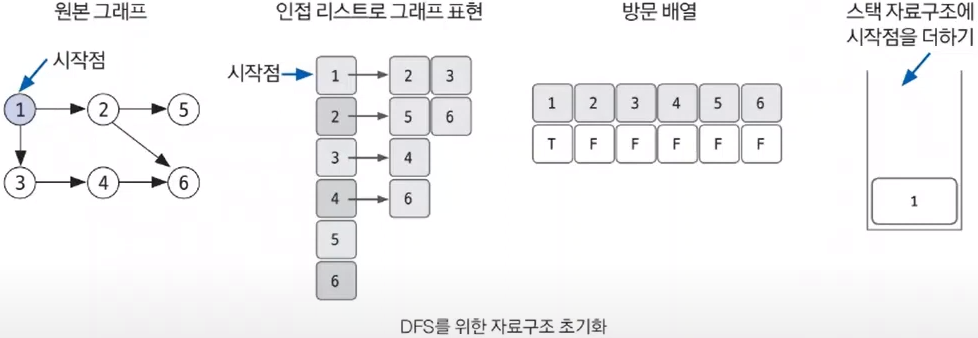
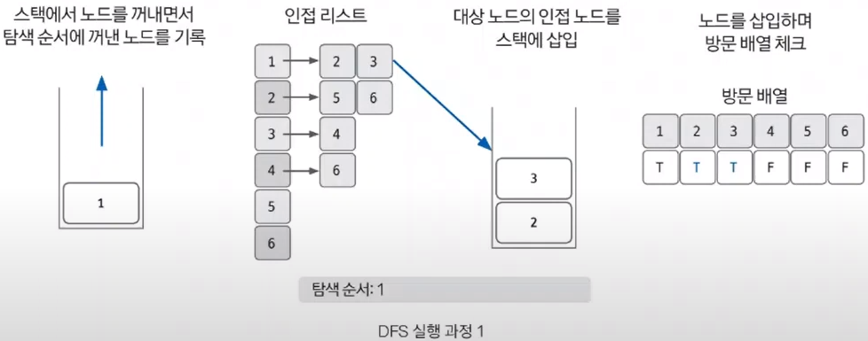
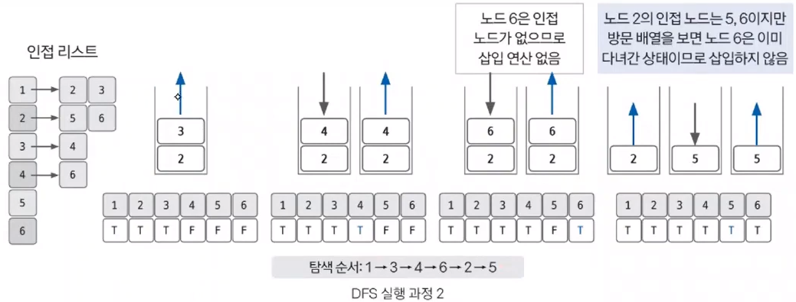

# Do it! 알고리즘 코딩테스트 with JAVA

---

### <2024-01-15>

## Section3 - DFS(깊이 우선 탐색)

### 📍DFS ?

**깊이 우선 탐색 : 그래프 완전 탐색 기법 중 하나**로, 시작 노드에서 출발하여 한 쪽 분기를 정하고 최대 깊이 까지 탐색을 마친 후 다른 쪽 분기로 이동하여 다시 탐색을 수행하는 알고리즘

**스택 자료구조(FILO) 이용해서 재귀함수로 구현**

  → 실제 재귀 함수로 이용 시 스택 오버플로우에 유의 해야함

  → 단절점 찾기, 단절선 찾기, 사이클 찾기, 위상 정렬 등이 있음

- DFS는 한 번 방문한 노드를 다시 방문하면 안되므로 **노드 방문 여부를 체크할 배열이 필요**
- 그래프는 인접 리스트로 표현

<aside>
❗ 설명에서는 편의를 위해 스택 사용이지만 DFS 구현은 <b>스택보다는 스택 성질을 갖는 재귀 함수로 많이 구현**하므로 이번 설명 이후로는 재귀 함수로 구현됨</b>

</aside>

### 📍DFS 핵심 이론

1. DFS를 시작할 노드를 정한 후 사용할 자료구조(⇒ 인접 리스트) 초기화하기
    - 시작 노드 1에서 인접한 노드들을 리스트로 표현
    - 방문한 노드는 T, 그렇지 않으면 F로 선언하고 스택자료구조에 시작 노드 1을 삽입

1. 스택에서 노드를 꺼낸 후 인접노드 스택에 다시 삽입하기
- pop 수행으로 1 노드를 꺼내고 탐색 순서에 기입해준다.
- 인접 리스트의 인접 노드 2와 3을 스택에 삽입 후 방문 배열에 T로 설정

1. 스택 자료구조에 값이 없을 때까지 반복하기
- 1,2 과정을 스택 자료구조에 값이 없을 때까지 반복하고 이미 다녀간 노드는 방문 배열을 바탕으로 재삽입하지 않는 것이 핵심입니다.

