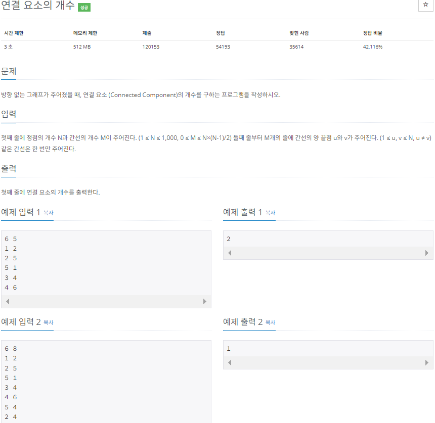

# 🔓연결 요소의 개수 구하기 (백준 11724)

---

### <2024-01-16>



- DFS 구현 시에 자료구조 인접 리스트 먼저 선언 !!
- 방문 배열에서 boolean 값 참고하면서 탐색

모든 노드를 탐색하는데 실행한 DFS의 실행 횟수 ⇒ 연결 요소 개수와 같다.

```java
package Section3;

import java.io.BufferedReader;
import java.io.IOException;
import java.io.InputStreamReader;
import java.util.StringTokenizer;
import java.util.ArrayList;

public class Sol_11724 {
    // 방문 노드 배열 생성
    static boolean[] visited;
    // 그래프 데이터 인접 리스트
    static ArrayList<Integer>[] arrayList;
    public static void main(String[] args) throws IOException{
        BufferedReader bf = new BufferedReader(new InputStreamReader(System.in));
        StringTokenizer st = new StringTokenizer(bf.readLine());

        // 노드 N, 앳지 M
        int N = Integer.parseInt(st.nextToken());
        int M = Integer.parseInt(st.nextToken());
        // 방문 노드 인덱스 0번을 사용하지 않기 위해 +1로 배열 선언
        visited = new boolean[N+1];
        // 그래프 데이터 인접 리스트
        arrayList = new ArrayList[N+1];

        for(int i=1; i<N+1; i++){
            arrayList[i] = new ArrayList<>();
        }

        // M번의 입력을 받아서 인접리스트에 그래프 데이터 저장
        for(int i=0; i<M; i++){
            st = new StringTokenizer(bf.readLine());
            int start = Integer.parseInt(st.nextToken());
            int end = Integer.parseInt(st.nextToken());
            // 양방향에 모두 저장
            arrayList[start].add(end);
            arrayList[end].add(start);
        }
        int cnt = 0;

        for(int i=1; i<N+1; i++){
            // 방문하지 않은 노드가 있다면
            if(!visited[i]){
                // + 연결 요소 개수
                cnt++;
                // 현재 방문하지 않은 노드부터 dfs 실행
                dfs(i);
            }
        }
        // 연결 요소 개수 출력
        System.out.println(cnt);
    }

    private static void dfs(int v) {
        // 방문 노드이면
        if(visited[v]){
            return; // 탐색 x
        }
        visited[v] = true;
        for(int i : arrayList[v]){
            // 탐색하지 않은 노드가 있다면 그 노드를 기준으로 dfs 실행
            if(!visited[i]){
                // 재귀 함수 형태로 구현
                dfs(i);
            }
        }
    }
}
```