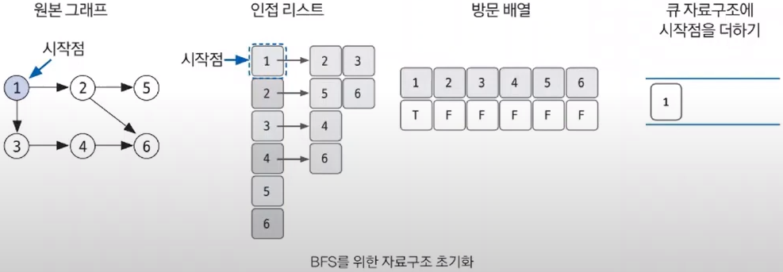
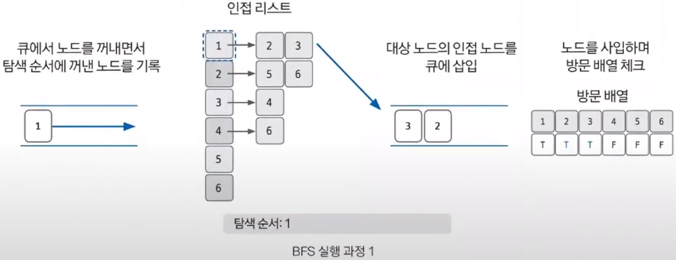
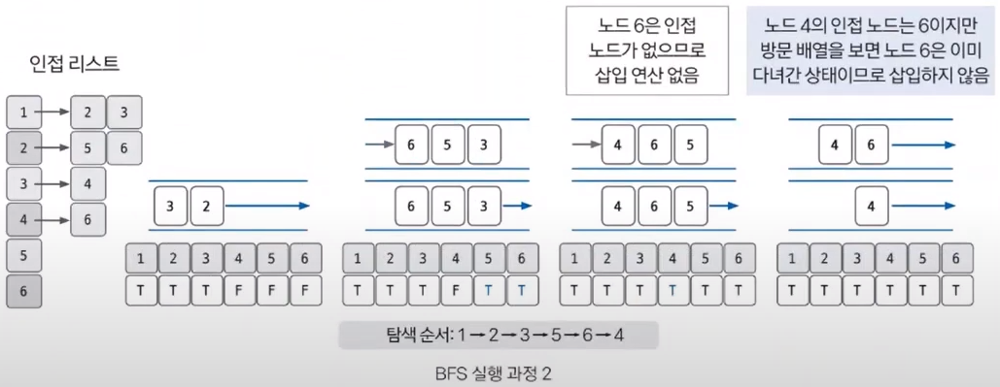

# BFS(너비 우선 탐색)

### <2024-01-23>

### 📍BFS ?

**너비 우선 탐색 : 그래프를 완전 탐색하는 방법 중 하나**로, 시작 노드에서 출발해 **시작 노드를 기준으로 가까운 노드를 먼저 방문해 먼저 탐색**하는 알고리즘

- **큐** **자료구조(FIFO) 이용해서 구현**
- 탐색 시작 노드와 가까운 노드를 우선하여 탐색하므로 **목표 노드에 도착하는 경로가 여러 개일 때 최단 경로를 보장**함

### 📍BFS 핵심 이론

1. BFS를 시작할 노드를 정한 후 사용할 자료구조 (⇒ 인접 리스트) 초기화하기
    - 시작 노드 1에서 인접한 노드들을 리스트로 표현
    - 방문한 노드는 T, 그렇지 않으면 F로 선언하고 큐 자료구조에 시작 노드 1을 삽입

2. 큐에서 노드를 꺼낸 훟 꺼낸 노드의 인접노드를 다시 큐에 삽입하기
- 방문 배열을 체크하여 이미 방문한 노드는 큐에 삽입하지 않기
- 큐에서 꺼낸 노드는 탐색 순서에 기록
- 아래의 그림은 1을 꺼내며 탐색 순서에 1을 기록하고 인접 노드 2, 3를 큐에 삽입하여 방문 배열에 체크

3. 큐 자료구조에 값이 없을 때까지 반복하기
- 선입선출 방식으로 큐에 노드가 없을 때까지 앞선 과정을 반복
- 2번 꺼내서 탐색 순서에 기록하고 2번의 인접 리스트 5, 6을 큐에 삽입, 3번 꺼내고 탐색 순서에 기록 후 3번의 인접 리스트 4번 삽입, 5번과 6번은 인접 리스트 없으므로 탐색 순서에 기록만 함, 마지막 4번의 인접 리스트 6번은 이미 방문한 노드이므로 삽입하지 않고 4번을 탐색 순서에 기록

