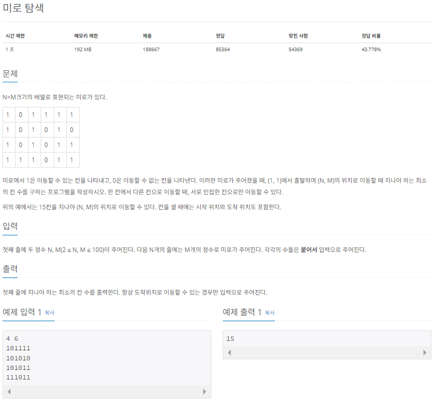
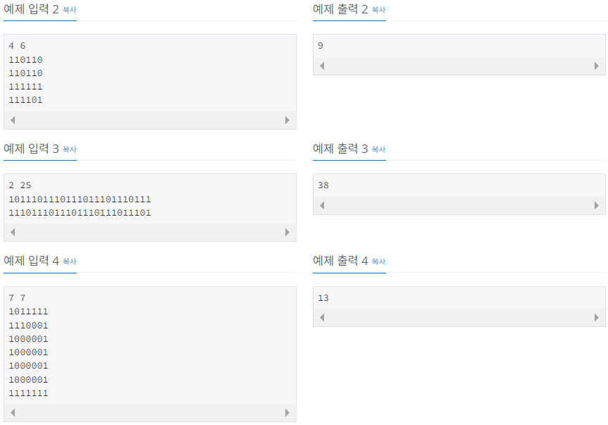

# 🔓
# 미로 탐색(백준 2178)

---

### <2024-01-25>





- 문제의 요구 사항은 칸 수의 최솟값을 찾는 것으로 dfs보다 bfs가 적합함
- 해당 깊이에서 갈 수 있는 노드 탐색을 마친 후 다음 깊이로 넘어가는 방식이므로 bfs 활용해서 풀이
- 상하좌우를 탐색하면서 1을 더해주면서 이동할 배열에 저장하고 최단 경로를 파악하기

```java
package Section3;

import java.io.IOException;
import java.io.BufferedReader;
import java.io.InputStreamReader;
import java.util.LinkedList;
import java.util.Queue;
import java.util.StringTokenizer;

public class Sol_2178 {
    // 상하좌우를 탐색하기 위한 변수
    // (0, 1), (1, 0), (0, -1), (-1, 0)
    static int[] dx = {0, 1, 0, -1};
    static int[] dy = {1, 0, -1, 0};
    static boolean[][] visited;
    static int[][] A;
    static int N, M;
    public static void main(String[] args) throws IOException{
        BufferedReader bf = new BufferedReader(new InputStreamReader(System.in));
        StringTokenizer st = new StringTokenizer(bf.readLine());
        N = Integer.parseInt(st.nextToken());
        M = Integer.parseInt(st.nextToken());
        A = new int[N][M];
        visited = new boolean[N][M];

        for(int i=0; i<N; i++){
            st = new StringTokenizer(bf.readLine());
            String line = st.nextToken();
            for(int j=0; j<M; j++){
                A[i][j] = Integer.parseInt(line.substring(j, j+1));
            }
        }
        
        bfs(0, 0);
        System.out.println(A[N-1][M-1]);
    }

    private static void bfs(int i, int j) {
        Queue<int[]> queue = new LinkedList<>();
        // 시작점을 설정
        queue.offer(new int[] {i, j});
        visited[i][j] = true;

				// queue가 비어있을 때까지 반복
        while(!queue.isEmpty()){
            int now[] = queue.poll();
            // 상하좌우로 탐색
            for(int k=0; k<4; k++){
                int x = now[0] + dx[k];
                int y = now[1] + dy[k];
                // 미로 범위 안에 있고
                if(x >=0 && y >= 0 && x < N && y < M){
                    // 이동할 수 있는 칸이고 방문하지 않은 칸
                    if(A[x][y] != 0 && !visited[x][y]){
                        visited[x][y] = true;
                        // depth를 현재 노드의 depth + 1로 업데이트하기
                        A[x][y] = A[now[0]][now[1]] + 1;
                        queue.add(new int[]{x, y});
                    }
                }
            }
        }
    }
}
```

❗상하좌우를 탐색하는 for문에서 k++가 아닌 i 변수를 증가시켜서 시간 초과 에러가 발생해서 디버깅을 통해 발견함 ..!!

- 예제 입력 1을 탐색하면 아래의 표처럼 나타나면서 최소 15칸 움직여야 하는 것을 알 수 있다.

| 1 | 0 | 9 | 10 | 11 | 12 |
| --- | --- | --- | --- | --- | --- |
| 2 | 0 | 8 | 0 | 12 | 0 |
| 3 | 0 | 7 | 0 | 13 | 14 |
| 4 | 5 | 6 | 0 | 14 | 15 |