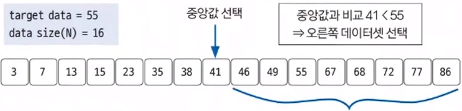
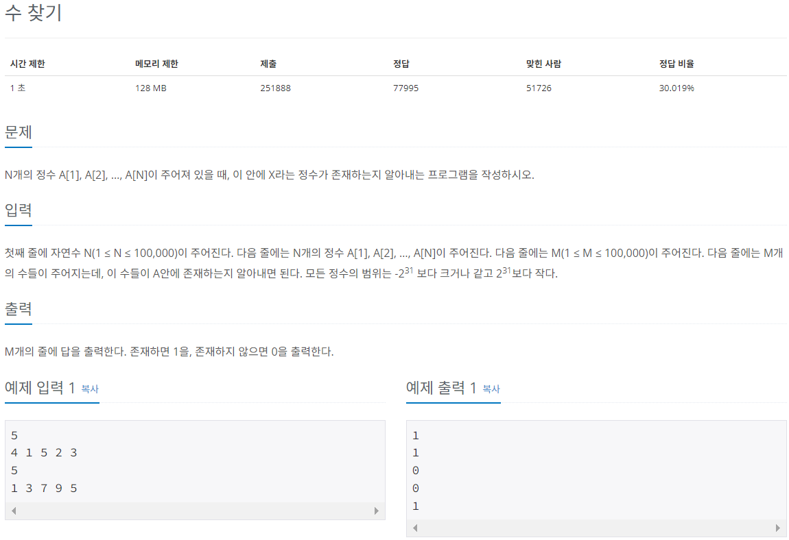

# 이진 탐색(Binary Search)

---

### <2024-03-06>

### 📍이진 탐색 ?

**데이터가 정렬되어 있는 상태에서 원하는 값을 찾아내는 알고리즘**으로 대상 데이터의 중앙값과 찾고자 하는 값을 비교해 데이터의 크기를 절반씩 줄이면서 대상을 찾음

📍**이진 탐색의 핵심 이론**

1. 현재 데이터 셋의 중앙값을 선택한다. ex) 11개의 수이면 중앙값은 6번째의 값
2. 중앙값 > 타깃 데이터 → 중앙값 기준으로 왼쪽 데이터셋을 선택한다.
3. 중앙값 < 타깃 데이터 → 중앙값 기준으로 오른쪽 데이터셋을 선택한다.

   

4. 과정 1~3을 반복하다 중앙값과 타깃 데이터 값이 같을 때 탐색을 종료한다.

   

이렇게 이진 탐색을 사용하면 N개의 데이터에서 $log(N)$번의 연산을 원하는 데이터의 위치를 찾을 수 있습니다. 예를들어 16개의 데이터면 최대 4번의 연산으로 원하는 데이터의 위치를 찾을 수 있습니다. 다만, **반드시 정렬된 상태**여야 합니다.

## 🔓원하는 정수 찾기(백준 1920)

---



- 중앙값을 배열의 길이에서 홀짝을 구분지어 구하려 했지만 왼쪽 오른쪽 탐색을 할 수 없음
- 강의의 풀이대로 처음과 끝 인덱스를 더한 후 2로 나누고 중앙값과 타겟값의 비교로 이진 탐색 알고리즘 풀이를 사용함
- 강의에선 사용하지 않았지만 이진 탐색 메소드를 따로 정의해서 가독성을 높였길 바람..ㅎㅎ

```java
package Section3;

import java.util.Arrays;
import java.util.Scanner;

public class Sol_1920 {
    static int target;
    static int[] A;
    public static void main(String[] args){
        Scanner sc = new Scanner(System.in);

        int N = sc.nextInt();
        A = new int[N];
        for(int i=0; i<A.length; i++){
            A[i] = sc.nextInt();
        }
        Arrays.sort(A);

        int M = sc.nextInt();
        for(int i=0; i<M; i++) {
            target = sc.nextInt();
            int start = 0;
            int end = A.length - 1;
            // 이진 탐색 메소드
            int ans = binary_search(A, start, end, target);
            System.out.println(ans);
        }
    }
    private static int binary_search(int[] a, int start, int end, int t) {
        while(start <= end) {
            int mid_idx = (start + end) / 2;
            if(a[mid_idx] > t){
                end = mid_idx - 1;
            }
            else if(a[mid_idx] < t){
                start = mid_idx + 1;
            }
            else {
                return 1;
            }
        }
        return 0;
    }
}

```