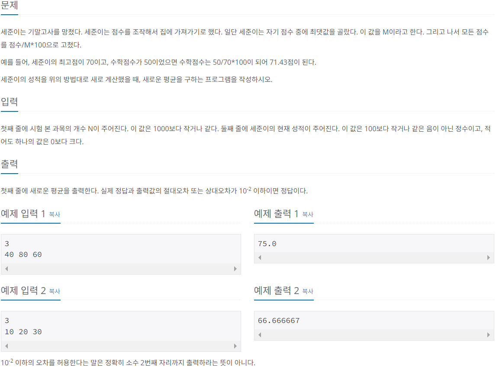
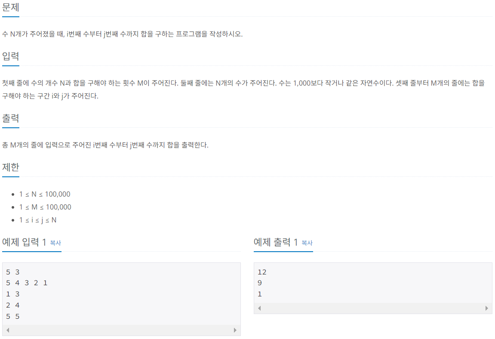
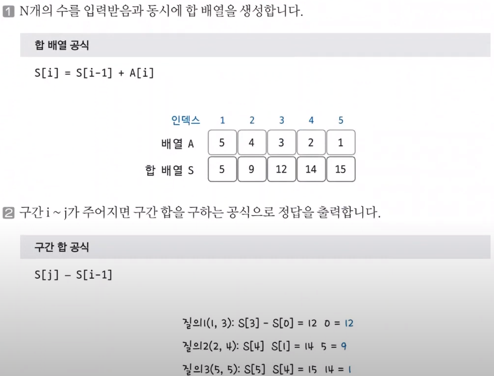

# Do it! 알고리즘 코딩테스트 with JAVA

---

### <2023-11-17>

## Section1 - 배열과 리스트

### 🔓 평균 구하기 (백준 1546)



- 점수 중 최댓값으로 나눈 후 100을 곱해서 평균 값을 구하는 식이므로 점수들을 미리 더하고 후에 평균을 계산함
- $10^2$ 이하의 오차를 허용하고 avg 변수에 저장할 때 100.0 곱해서 double형으로 자동 형변환함

```java
package Section1;

import java.util.Scanner;

public class Sol_1546 {
    public static void main(String[] args) {
        Scanner sc = new Scanner(System.in);
        int n = sc.nextInt();
        int[] grade = new int[n];

        int max = 0, sum = 0;
        double avg = 0;

        for(int i=0; i<grade.length; i++){
            grade[i] = sc.nextInt();
            max = Math.max(max, grade[i]);
            sum += grade[i];
        }

        avg = sum * 100.0 / max / n;
        System.out.println(avg);
    }
}
```

## Section1 - 구간 합

구간 합 : **합 배열을 이용하여 시간 복잡도를 더 줄이기 위해 사용**하는 특수한 목적의 알고리즘

### 🔓 구간 합 구하기 (백준 11659)



- 합 배열을 미리 생성 ⇒ 합 배열 공식
- 합이 누적된 배열에서 끝 구간에서 질의 첫 구간 전의 데이터를 빼주면 한 번의 계산으로 리턴 가능 ⇒ 구간 합 공식



<aside>
💡 입력이 많은 경우 Scanner 대신 BuffereReader를 사용해서 처리 속도를 빠르게 하고, BufferedReader는 문자열로 저장되기 때문에 다른 타입으로 저장할 경우 반드시 형변환을 해줘야함

</aside>

```java
package Section1;

import java.io.BufferedReader;
import java.io.IOException;
import java.io.InputStreamReader;
import java.util.StringTokenizer;

public class Sol_11659 {
    public static void main(String[] args) throws IOException {
        BufferedReader bufferedReader = new BufferedReader(new InputStreamReader(System.in));

        // readLine() = > 첫 번째 줄 읽음
        StringTokenizer stringTokenizer = new StringTokenizer(bufferedReader.readLine());

        int numNo = Integer.parseInt(stringTokenizer.nextToken());
        int resultNo = Integer.parseInt(stringTokenizer.nextToken());
        long[] result = new long[numNo+1];

        stringTokenizer = new StringTokenizer(bufferedReader.readLine());

        for(int i=1; i<result.length; i++){
            result[i] = result[i-1] + Integer.parseInt(stringTokenizer.nextToken());
        }
        for(int i=0; i<resultNo; i++){
            stringTokenizer = new StringTokenizer(bufferedReader.readLine());
            int start = Integer.parseInt(stringTokenizer.nextToken());
            int end = Integer.parseInt(stringTokenizer.nextToken());
            System.out.println(result[end] - result[start-1]);
        }
    }
}
```

> BufferedReader 사용이 처음이라 어색했다. 하지만 필요한 곳에 사용하기 위해서는 알아야 하기 때문에 찾아보니 어려운 것이 아니었고 오히려 입력 처리 속도로 봤을 때 알고있던 Scanner보다 더 좋은 친구였다. 오늘도 새로 알아가는 것에 두려운 마음을 접고 습득한 기쁨을 느꼈다.
>