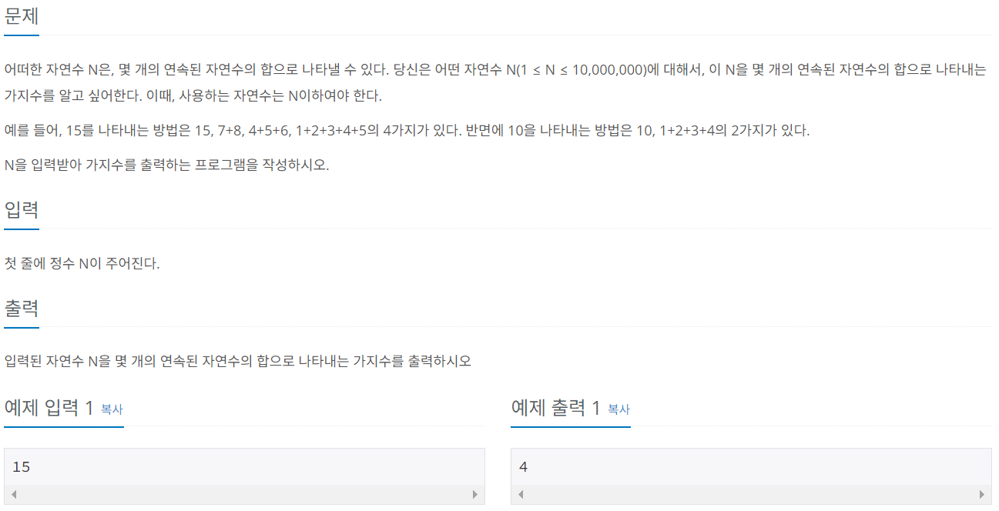
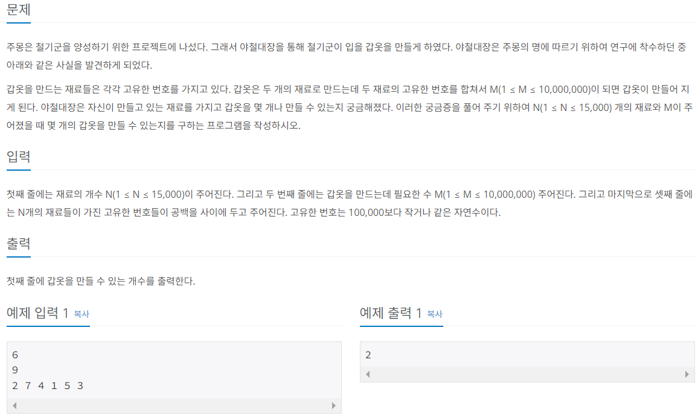

# Do it! 알고리즘 코딩테스트 with JAVA

---

### <2023-11-20>

## Section1 - 구간 합

**투포인터 알고리즘** : 배열 안에서 각자 다른 원소를 가리키는 포인터 2개를 설정, 포인터들의 위치를 조정해서 원하는 값을 얻는 알고리즘

### 🔓 수들의 합 (백준 2018)



완전 탐색으로 풀이 ⇒ 시간 복잡도 $O(n^2)$

투 포인터 알고리즘 풀이 ⇒ 시간 복잡도 $O(n)$

N의 최대값이 10,000,000으로 매우 커서 완전 탐색 보단 투 포인터로 해결하는 것이 적절함

- start_idx, end_idx 포인터 변수를 설정
- 완전 탐색 풀이와 다른점은 **누적된 합계(sum)가 n보다 커질 경우 start_idx를 조정**(sum - start_idx 후 start_idx++)해서 n을 찾는 것

```java
import java.util.Scanner;

public class Sol_2018{
    public static void main(String[] args) {
        Scanner sc = new Scanner(System.in);
        int n = sc.nextInt();
        
        int start_idx = 1;
        int end_idx = 1;
        int sum = 1;
        int cnt = 1;

        while(end_idx != n){
            if(sum == n){
                cnt++;
                end_idx++;
                sum += end_idx;
            }
            else if(sum > n){
                sum -= start_idx;
                start_idx++;
            }
            else{
                end_idx++;
                sum += end_idx;
            }
        }
        System.out.println(cnt);
    }
}
```

- 2중 for문으로 로직을 짜서 완전 탐색 알고리즘 형식으로 풀이함(본인의 풀이)

```java
package Section1;

import java.util.Scanner;

public class Sol_2018 {
    public static void main(String[] args) {
        Scanner sc = new Scanner(System.in);
        int n = sc.nextInt();

        int cnt = 1;
        for(int i=1; i<=n/2; i++){
            int sum = i;
            for(int j=i+1; j<=(n/2)+1; j++){
                sum += j;
                if(sum > n)
                    break;
                else if(sum == n){
                    cnt++;
                    break;
                }
            }
        }
        System.out.println(cnt);
    }
}
```

### 🔓 주몽 (백준 1940)

이번에는 **투포인터 알고리즘으로 풀이**해보았음



- 입력이 많아서 BufferedReader로 입력을 받고 재료들의 개수는 배열로 입력받아서 정렬함
- 투포인터 변수 start, end를 최소, 최대 값으로 초기화하고 서로 더한 결과가 주어진 m보다 작으면 start를 조정, 크면 end를 조정
- 원하는 값이면 포인터들을 모두 조정하고 서로 교차될 때까지 while문 반복

```java
package Section1;

import java.io.BufferedReader;
import java.io.IOException;
import java.io.InputStreamReader;
import java.util.StringTokenizer;
import java.util.Arrays;
public class Sol_1940 {
    public static void main(String[] args) throws IOException{
        BufferedReader br = new BufferedReader(new InputStreamReader(System.in));
        int ingredient_num = Integer.parseInt(br.readLine());
        int m = Integer.parseInt(br.readLine());
        int[] ingredient = new int[ingredient_num];

        StringTokenizer st = new StringTokenizer(br.readLine());

        for(int i=0; i<ingredient_num; i++){
            ingredient[i] = Integer.parseInt(st.nextToken());
        }
        Arrays.sort(ingredient);

        int cnt = 0;
        int start = 0;
        int end = ingredient_num - 1;

        while(start < end){
            if(ingredient[start] + ingredient[end] < m){
                start++;
            }
            else if(ingredient[start] + ingredient[end] == m){
                cnt++;
                start++;
                end--;
            }
            else{
                end--;
            }
        }
        System.out.println(cnt);
    }
}
```

> 수들의 합 풀이를 할 때 완전 탐색으로도 해결되길래 이렇게 해도 되지 않을까? 하는 생각으로 투포인터 알고리즘을 넘어가려고 했지만 시간 복잡도를 보니 그런 생각이 사라졌고, 오히려 알고나니 새로운 알고리즘을 습득해서 기분이 좋아졌다. 항상 비슷한 문제가 나오면 2중 for문으로만 풀이할 생각을 했는데 변수를 따로 설정해서 while문으로 구현하니 가독성도 더 좋은거 같고 이해하고서 주몽 문제 풀이는 스스로 투포인터 알고리즘으로 풀이했다. 주몽에서는 입력이 많아서 BufferedReader를 사용했다. 평소 잘 쓰지 않아서 어색했는데 이번 문제를 통해서 익숙해질 수 있었고, Scanner보다 처리 속도도 빠르고 StringTokenizer를 통해 공백을 기준으로 데이터를 가공하는 방식도 알게되었다. 강의에 의존하지 않고 여러 사람들의 블로그와 정리 내용을 통해 알아보니 더욱 쉽게 이해할 수 있었다.
>