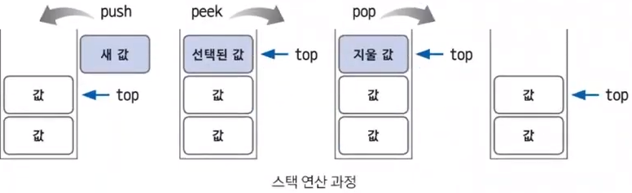
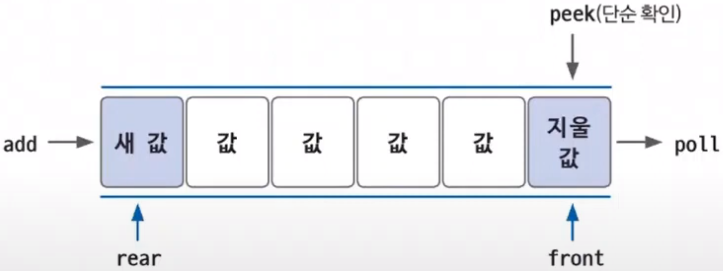
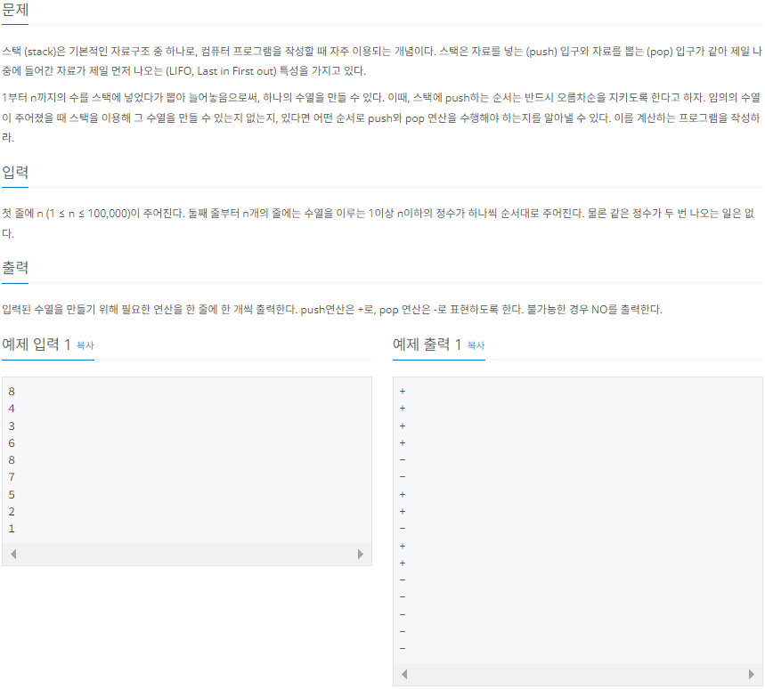

# Do it! 알고리즘 코딩테스트 with JAVA

---

### <2023-11-27>

## Section1 - 스택과 큐

- ****************************스택**************************** : 삽입과 삭제 연산이 **후입선출(LIFO)**로 이뤄지는 자료구조

  삽입과 삭제가 한 쪽에서만 일어나는 특징이 있음

  **깊이 우선 탐색(DFS), 백트래킹** 종류의 테스트에 효과적이고 **재귀 함수 알고리즘 원리와 일맥상통**함




push : 새로운 데이터를 top 위치에 삽입

pop : top 위치에 데이터를 확인하고 삭제하는 연산

peek : top 위치에 데이터를 단순 확인하는 연산

- ****큐**** : 삽입과 삭제 연산이 **선입선출(FIFO)**로 이뤄지는 자료구조

  삽입과 삭제가 양방향에서 일어나는 특징이 있음

  **너비 우선 탐색(BFS)**에서 자주 사용됨




rear : 큐에서 가장 끝 데이터를 가리키는 영역

front : 큐에서 가장 앞 데이터를 가리키는 영역

add : rear 부분에 새로운 데이터를 삽입하는 영역

poll : front 부분에 있는 데이터를 확인하고 삭제하는 연산(pop과 유사)

peek : 큐의 맨 앞(front)에 있는 데이터를 확인할 때 사용하는 연산

### 🔓스택 수열 (백준 1874)




```java
package Section1;

import java.io.IOException;
import java.io.InputStreamReader;
import java.io.BufferedReader;
import java.util.ArrayList;
import java.util.Stack;

public class Sol_1874{
    public static void main(String[] args) throws IOException{
        BufferedReader bf = new BufferedReader(new InputStreamReader(System.in));
        int n = Integer.parseInt(bf.readLine());
        int[] num_arr = new int[n];
        ArrayList<String> arrayList = new ArrayList<>();

        // 수열 값 입려
        for(int i=0; i<num_arr.length; i++){
            num_arr[i] = Integer.parseInt(bf.readLine());
        }
        Stack<Integer> stack = new Stack();

        // 오름차순을 비교할 수
        int num = 1;
        for(int i=0; i<num_arr.length; i++){
            if(num_arr[i] >= num){
                // 수열 값과 같아질때 까지 스택에 저장
                while(num_arr[i] >= num){
                    stack.push(num);
                    arrayList.add("+");
                    num++;
                }
                // 같다면 스택에서 제외
                stack.pop();
                arrayList.add("-");
            }
            else if(num_arr[i] <= num){
                if(stack.peek().equals(num_arr[i])){
                    stack.pop();
                    arrayList.add("-");
                }
                else{ // 스택의 값이 더 클 경우 오름차순이 될 수 없음
                    System.out.println("NO");
                    return;
                }
            }
        }
        for(String res : arrayList){
            System.out.println(res);
        }
    }
}
```

- ArrayList 생성 대신 StringBuffer 클래스를 사용해서 문자열을 추가하고 바로 출력해도됨

### 🔓카드2 (백준 2164)


- 선입선출 성질을 이용 Queue 풀이

```java
package Section1;

import java.util.LinkedList;
import java.util.Queue;
import java.util.Scanner;

public class Sol_2164 {
    public static void main(String[] args) {
        Scanner sc = new Scanner(System.in);
        Queue<Integer> queue = new LinkedList<>();
        int n = sc.nextInt();

        for(int i=1; i<n+1; i++){
            queue.add(i);
        }

        while(queue.size() > 1){
            queue.poll();
						// queue.add(queue.poll()); 아래 두 문장과 동일
            queue.add(queue.peek());
            queue.poll();
        }
        System.out.println(queue.peek());
    }
}
```