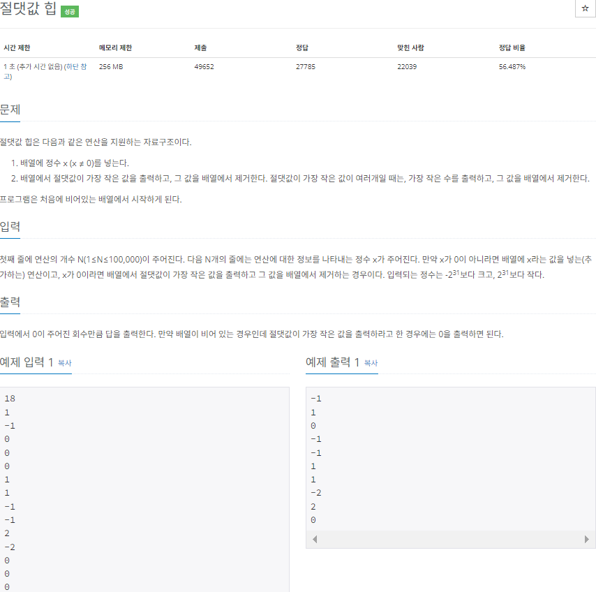

# Do it! 알고리즘 코딩테스트 with JAVA
---

### <2023-12-12>

## 🔓절댓값 힙 (백준 11286)



```java
package Section1;

import java.io.BufferedReader;
import java.io.IOException;
import java.io.InputStreamReader;
import java.util.PriorityQueue;
import java.util.Stack;

public class Sol_11286 {
    public static void main(String[] args) throws IOException {
        BufferedReader bf = new BufferedReader(new InputStreamReader(System.in));
        PriorityQueue<Integer> pq = new PriorityQueue<>((o1, o2) -> {
            int a = Math.abs(o1);
            int b = Math.abs(o2);

            // 절댓값이 가장 작은 값
            if(a > b){
                // 양수가 반환되면 o2, o1 순으로 정렬
                // 음수가 반환되면 o1, o2 유지
                return a - b;
            }
            // 절댓값이 같을 때
            else if(a == b){
                // o1이 더 크면 양수 반환해서 o2, o1 순으로 정렬
                // o2 더 크면 음수 반환해서 o1, o2 유지
                return o1 > o2 ? 1 : -1;
            }
            else {
                return -1;
            }
        });
        int n = Integer.parseInt(bf.readLine());

        // 18번 반복문
        for(int i=0; i<n; i++) {
            int x = Integer.parseInt(bf.readLine());
            if (x == 0) {
                if (pq.isEmpty()) {
                    System.out.println(0);
                }
                else{
                    System.out.println(pq.poll());
                }
            } else {
                // 큐 추가
                pq.add(x);
            }
        }
    }
}
```

- 단순히 제일 작은 수를 출력하는 for문을 작성하다가 “절댓값 중에서 작은 수” 조건을 생각하지 못함
- 익숙하지 않던 우선순위 큐 구현이었는데 강의를 통해 이해하니 훨씬 간단했고 **작은 수를 출력하는 것이니 음수 반환과 순서를 변경하고 유지하는 것에 신경써야 했음**