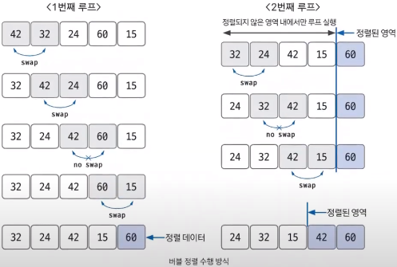
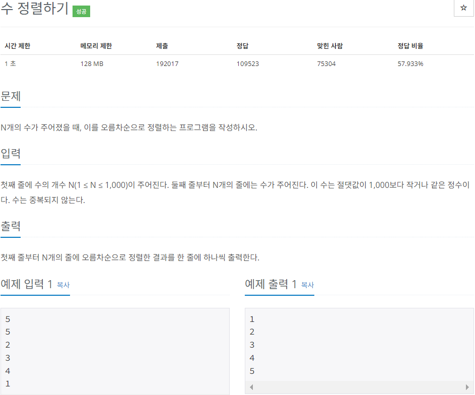

# Do it! 알고리즘 코딩테스트 with JAVA

---

### <2023-12-19>

## Section2 - 버블 정렬

**버블 정렬 : 인접한 데이터의 크기를 비교해 정렬하는 방법**

**시간 복잡도는 $O(n^2)$으로 다른 정렬 알고리즘보다 속도가 느린 편이다.**

아래의 그림과 같이 loop를 돌면서 인접한 데이터 간의 swap 연산으로 정렬한다.



1. 비교 연산이 필요한 루프 범위를 설정하고, 인접한 데이터 값을 비교한다.
2. swap 조건에 부합하면 swap 연산을 수행하고, 루프 범위가 끝날 때까지 값을 비교하며 swap 연산을 수행한다.
3. 정렬 영역을 설정해서 다음 루프를 실행 할 때는 이 영역을 제외한다.

만약, 루프 전체 영역에서 swap 연산이 한 번도 발생하지 않았다면 데이터가 모두 정렬 됐다는 뜻이므로 프로세스를 종료해도 된다.

## 🔓수 정렬하기 (백준 2750)



```java
package Section2;

import java.util.Scanner;

public class Sol_2750 {
    public static void main(String[] args) {
        Scanner sc = new Scanner(System.in);
        int n = sc.nextInt();
        int[] arr = new int[n];

        // n까지 수 랜덤으로 입력
        for(int i=0; i<n; i++){
            arr[i] = sc.nextInt();
        }

        // 버블 정렬 구현
        for(int i=0; i<arr.length-1; i++){
            for(int j=0; j<arr.length-i-1; j++){
                if(arr[j] > arr[j+1]){
                    int tmp = arr[j];
                    arr[j] = arr[j+1];
                    arr[j+1] = tmp;
                }
            }
        }
        for(int i : arr){
            System.out.println(i);
        }
    }
}
```

- 이전 풀이와는 달리 인접한 데이터들끼리 비교한 후에 정렬된 끝자리는 검사하지 않는 코드(=버블 정렬)로 풀이해보았다.