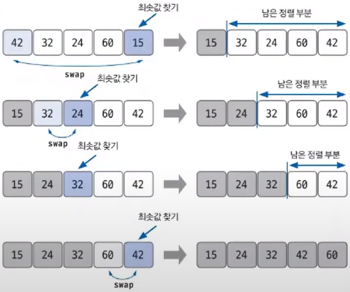

# Do it! 알고리즘 코딩테스트 with JAVA

---

### <2024-01-02>

## Section2 - 선택 정렬

**선택 정렬 : 최대나 최소 데이터를 데이터가 나열된 순으로 찾아가며 정렬하는 방법**

**시간 복잡도는 $O(n^2)$으로 효율적이지 않아 코테에는 많이 사용하지 않음**

최솟값 또는 최댓값을 찾고, 남은 정렬 부분의 가장 앞에 있는 데이터와 swap 하는 것이 선택 정렬의 핵심

1. 정렬이 되지 않은(남은 정렬) 부분에서 최소 또는 최댓값을 찾고 마찬가지로 남은 정렬 부분의 맨 앞 데이터와 swap
2. swap 후 맨 앞을 제외한 남은 정렬 부분의 범위를 축소하면서 남은 정렬 부분이 없을 때까지 반복

## 🔓소트인사이드 (백준 1427)

