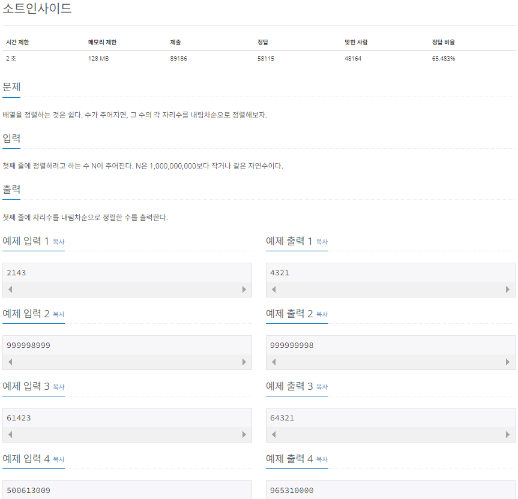

# Do it! 알고리즘 코딩테스트 with JAVA

---

### <2024-01-02>

## Section2 - 선택 정렬

**선택 정렬 : 최대나 최소 데이터를 데이터가 나열된 순으로 찾아가며 정렬하는 방법**

**시간 복잡도는 $O(n^2)$으로 효율적이지 않아 코테에는 많이 사용하지 않음**

최솟값 또는 최댓값을 찾고, 남은 정렬 부분의 가장 앞에 있는 데이터와 swap 하는 것이 선택 정렬의 핵심


1. 정렬이 되지 않은(남은 정렬) 부분에서 최소 또는 최댓값을 찾고 마찬가지로 남은 정렬 부분의 맨 앞 데이터와 swap
2. swap 후 맨 앞을 제외한 남은 정렬 부분의 범위를 축소하면서 남은 정렬 부분이 없을 때까지 반복

## 🔓소트인사이드 (백준 1427)



```java
package Section2;

import java.util.Scanner;
import java.util.Arrays;

public class Sol_1427 {
    public static void main(String[] args){
        Scanner sc = new Scanner(System.in);
        int N = sc.nextInt();
        String[] arr_str = String.valueOf(N).split("");
        int[] arr_int = new int[arr_str.length];

        for(int i=0; i<arr_int.length; i++){
            arr_int[i] = Integer.parseInt(arr_str[i]);
        }

        for(int i=0; i<arr_int.length; i++){
            int max = arr_int[i];
            int max_idx = i;
            int first = arr_int[i];
            for(int j=i; j<arr_int.length-1; j++){
                if(max < arr_int[j+1]){
                    max = arr_int[j+1];
                    max_idx = j+1;
                }
            }
            arr_int[i] = max;
            arr_int[max_idx] = first;
        }

        for(int i : arr_int){
            System.out.print(i);
        }
    }
}
```

- 강의에서는 max의 값을 i로 저장해서 인덱스 번호까지 같이 활용했지만 본인은 max 값과 그 인덱스 번호 변수를 각각 선언함
- 예제의 출력문의 맞게 일자로 출력되야 하므로 println 대신 print 사용