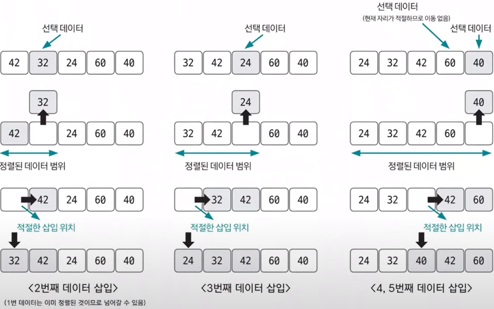

# Do it! 알고리즘 코딩테스트 with JAVA

---

### <2024-01-03>

## Section2 - 삽입 정렬

**삽입 정렬 : 이미 정렬된 데이터 범위에 정렬되지 않은 데이터를 적절한 위치에 삽입시켜 정렬하는 방법**

**시간 복잡도는 $O(n^2)$으로 느린 편이짐나 구현하기 쉽다.**

선택 데이터는 현재 정렬된 데이터 범위 내에서 적절한 위치에 삽입하는 것이 삽입 정렬의 핵심 !!

1. 현재 선택 데이터의 앞에 정렬된 데이터 범위에서 삽입될 위치를 탐색한다.
2. 삽입 위치가 결정되면 삽입 위치부터 선택 데이터의 기존 index 위치까지 shift 연산을 수행한다.
3. 삽입 위치에 현재 선택한 데이터를 삽입하고 index++ 수행
4. 선택할 데이터가 없을 때까지 반복 수행한다.

## Section2 - 퀵 정렬

**퀵 정렬 : 기준값을 선정해 해당 값보다 작은 데이터와 큰 데이터로 분류하는 것을 반복해 정렬하는 방법**

**평균 시간 복잡도는 $O(nlogn)$, 최악의 시간 복잡도는 $O(n^2)$이고 기준 값(pivot)이 어떻게 선정되는지가 시간 복잡도에 많은 영향을 미칩니다.**

pivot을 중심으로 계속 데이터를 2개의 집합으로 나누면서 정렬하는 것이 퀵 정렬의 핵심 !!