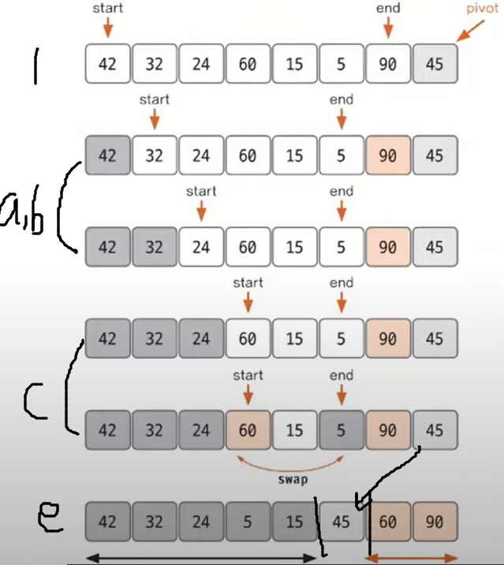

# Do it! 알고리즘 코딩테스트 with JAVA

---

### <2024-01-06>

## Section2 - 퀵 정렬

**퀵 정렬 과정**

1. 데이터를 분할하는 pivot(기준 데이터)을 설정하고, pivot을 기준으로 다음  a~e 과정을 거쳐 데이터를 2개의 집합으로 분리함
    1. start 데이터가 pivot 데이터보다 작으면 start 포인터는 오른쪽으로 1칸 이동한다.
    2. end 데이터가 pivot 데이터보다 크면 end 포인터는 왼쪽으로 1칸 이동한다.
    3. **start 데이터가 pivot 데이터보다 크고, end 데이터가 pivot 데이터보다 작으면(=a, b 조건과 반대), 데이터를 서로  swap하고 start는 오른쪽, end는 왼쪽을 1칸씩 이동한다.**
    4. start와 end가 만날 때 까지 a~c를 반복!!
    5. start와 end가 만나면 만난 지점에서의 데이터와 pivot 데이터를 비교하여 **pivot 데이터가 크면 만난 지점의 오른쪽, 작으면 만난 지점의 왼쪽에 pivot 데이터를 삽입**
2. 분리 집합에서 각각 다시 pivot 선정
3. 분리 집합이 1개 이하가 될 때까지 과정 1~2을 반복